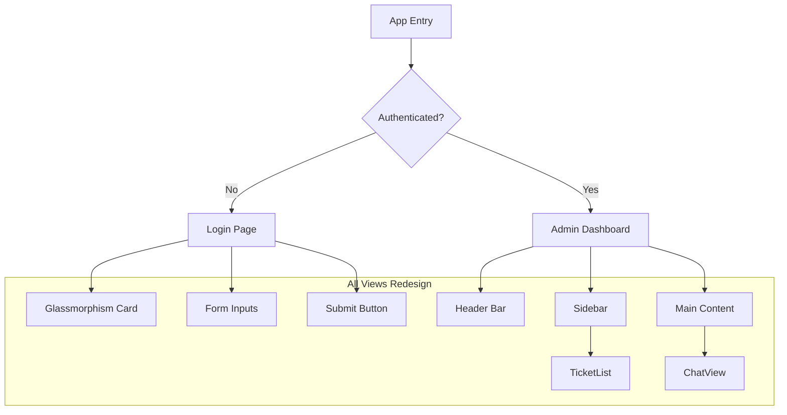

# Moni-Chat Professional Redesign Plan

## Current State Analysis

**Existing UI Components:**
- Login page with glassmorphism dark theme (already polished)
- Admin dashboard with sidebar + main content layout
- TicketList component (sidebar)
- ChatView component (main area)
- Basic stats display

**Areas for Improvement:**
- Header design feels dated
- Ticket list lacks visual hierarchy
- Chat bubbles need refinement
- Overall SaaS professional polish needed
- Spacing and typography inconsistencies

---

## Proposed Redesign: Modern SaaS Dashboard

### Design Direction
Clean, professional support dashboard inspired by Linear, Intercom, and Zendesk - emphasizing clarity, efficient information hierarchy, and subtle sophistication.

### Color Palette
| Token | Hex | Usage |
|-------|-----|-------|
| Primary | `#6366F1` (Indigo) | Actions, highlights |
| Primary Light | `#818CF8` | Hover states |
| Success | `#10B981` | Open tickets |
| Warning | `#F59E0B` | Pending states |
| Danger | `#EF4444` | Closed/error |
| Background | `#FAFAFA` | Main bg |
| Surface | `#FFFFFF` | Cards |
| Border | `#E5E7EB` | Dividers |
| Text Primary | `#111827` | Headings |
| Text Secondary | `#6B7280` | Body text |
| Text Muted | `#9CA3AF` | Timestamps |

### Typography
- **Font:** Inter (already imported)
- **Scale:** 12/14/16/18/24/32px
- **Weight:** 400 (body), 500 (medium), 600 (semibold), 700 (bold)

---

## Component Redesign

### 1. Header Redesign

**Current:** Simple bar with logo, title, stats
```
┌─────────────────────────────────────────┐
│ [Logo] MoniBook Support    [3 Mở][2 Đã]│
└─────────────────────────────────────────┘
```

**Proposed:** Sleeker command-bar style
```
┌──────────────────────────────────────────────────────────────┐
│  ┌─ Logo ─┐  Moni Support              🔍 Search...   [👤] │
├──────────────────────────────────────────────────────────────┤
│  [All] [Open (3)] [Closed (12)]              Sort ▼         │
└──────────────────────────────────────────────────────────────┘
```

### 2. Ticket List Redesign

**Current:** Basic list items with simple styling
**Proposed:** Card-based with richer info hierarchy
```
┌────────────────────────────────────────┐
│ 🔵 Urgent Support needed        2m ago│
│ Customer can't access account...      │
│ ○ Open                    👤 user_abc│
└────────────────────────────────────────┘
```

### 3. Chat View Redesign

**Current:** Standard chat bubbles
**Proposed:** Refined bubbles with better typography, timestamps, and visual distinction

```
┌─ Ticket: Cannot login ──────────────────┐
│ user_id: abc123...    ● Open   [Close] │
├────────────────────────────────────────┤
│                                       │
│  ┌─ User message ─────────────┐       │
│  │ Hello, I need help          │       │
│  │ 10:30 AM                    │       │
│  └────────────────────────────┘       │
│                                       │
│           ┌─ Admin message ──┐        │
│           │ Hi! How can I    │        │
│           │ help you today?  │        │
│           │        10:32 AM ─┘        │
│                                       │
├────────────────────────────────────────┤
│ [Type message...]              [Send] │
└────────────────────────────────────────┘
```

### 4. Stats Display
- Replace basic badges with pill-shaped indicators
- Add subtle hover animations
- Use proper semantic colors

---

## Implementation Tasks

### Step 1: Update CSS Design System (index.css)
- [ ] Complete color palette redesign
- [ ] Enhanced shadow system for depth
- [ ] Typography refinements
- [ ] Animation keyframes
- [ ] Loading/empty states
- [ ] Responsive utilities

### Step 2: Redesign Login Page
- [ ] Refined glassmorphism card
- [ ] Better input styling
- [ ] Enhanced button interactions
- [ ] Loading states
- [ ] Error animations

### Step 3: Redesign Admin Page
- [ ] Command-bar style header
- [ ] Integrated global search
- [ ] Better stats presentation with cards
- [ ] Refined tab navigation
- [ ] Sidebar improvements

### Step 4: Redesign TicketList Component
- [ ] Card-based layout with shadows
- [ ] Better typography hierarchy (title, preview, meta)
- [ ] Status badges with icons
- [ ] Priority indicators
- [ ] Hover states with subtle lift animation
- [ ] Selection highlight
- [ ] Loading skeleton

### Step 5: Redesign ChatView Component
- [ ] Improved header with ticket info
- [ ] Refined chat bubbles with better distinction
- [ ] Better message grouping by date
- [ ] Enhanced input area
- [ ] Send button animations
- [ ] Empty state with illustration
- [ ] Loading states

### Step 6: App-level Improvements
- [ ] Loading screen redesign
- [ ] Logout button styling
- [ ] Global transitions

---

## File Changes Summary

| File | Changes |
|------|---------|
| `src/App.tsx` | Loading state, logout button styling |
| `src/index.css` | Complete redesign of design system, all global styles |
| `src/pages/Login.tsx` | Glassmorphism login card refinement |
| `src/pages/Admin.tsx` | Header redesign, layout improvements |
| `src/components/TicketList.tsx` | Card-based redesign |
| `src/components/ChatView.tsx` | Bubble refinements, improved layout |

---

## Mermaid: Complete View Architecture



---

## Next Steps

Once approved, I'll switch to **Code mode** to implement all views:

### Phase 1: CSS Design System
- Complete `src/index.css` overhaul with new design tokens

### Phase 2: Login Page
- Refined glassmorphism login card in `src/pages/Login.tsx`
- Enhanced input styling and button interactions

### Phase 3: Admin Dashboard  
- Redesigned header with command-bar style in `src/pages/Admin.tsx`
- Improved sidebar and navigation

### Phase 4: TicketList Component
- Card-based layout in `src/components/TicketList.tsx`
- Richer visual hierarchy and hover effects

### Phase 5: ChatView Component
- Refined chat bubbles in `src/components/ChatView.tsx`
- Better message grouping and input area

### Phase 6: App-level Polish
- Loading states and transitions in `src/App.tsx`
